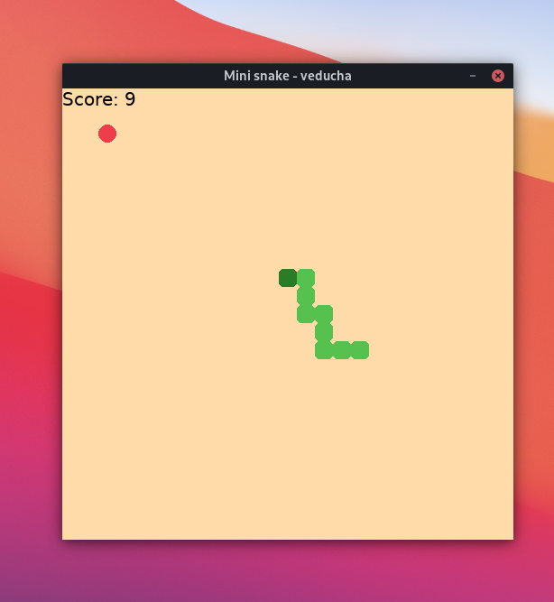
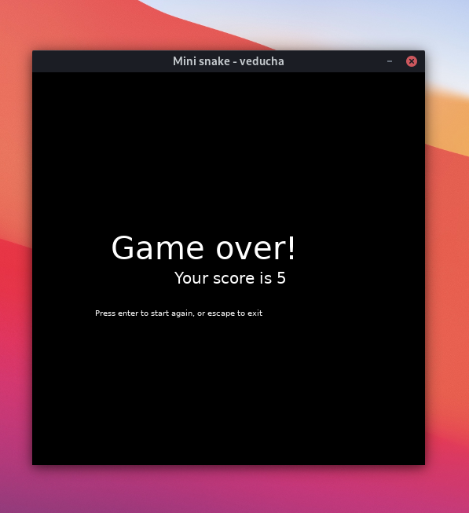

# snake-game
A simple and minimalistic snake game implemented in Python.
It was made as an weekend exercise to understand Python classes a bit better.

### How to
To run simply execute `main.py` and play the game with your arrow keys. You can pause the game with `Enter` and exit the game with `Esc`.

